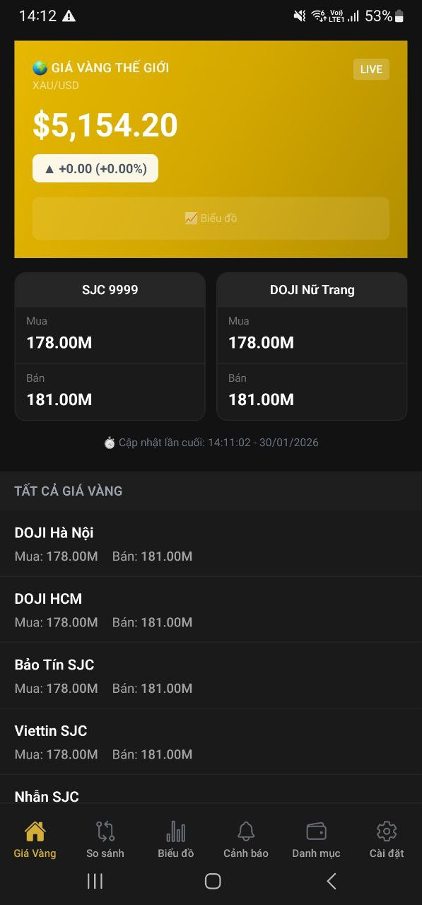
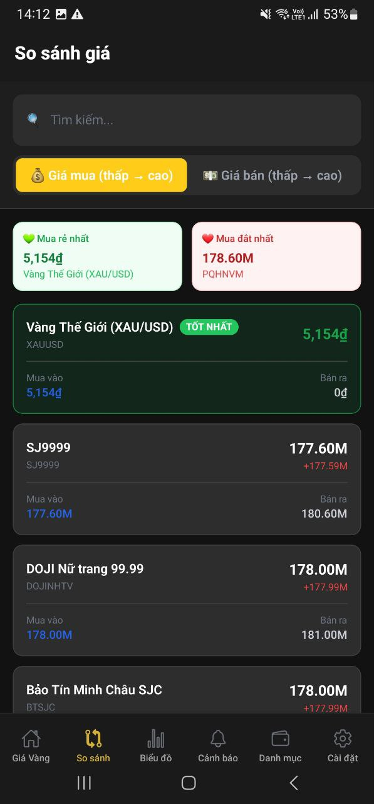
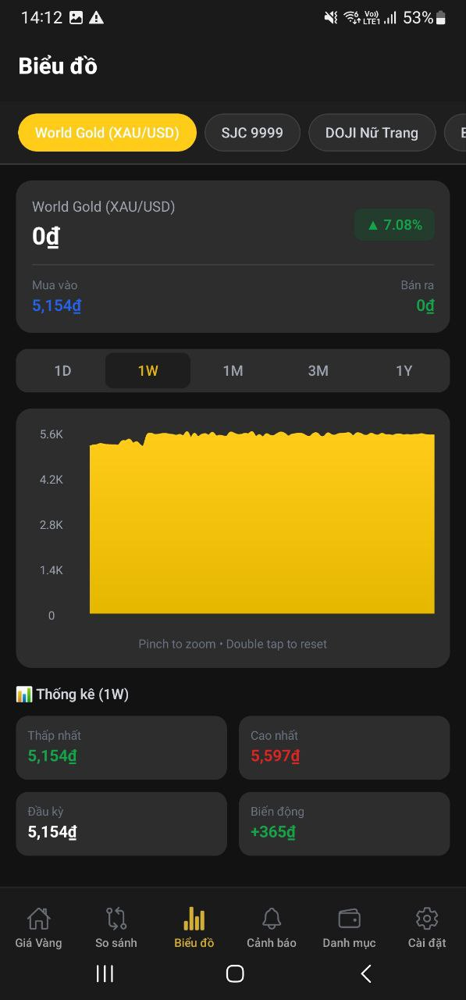
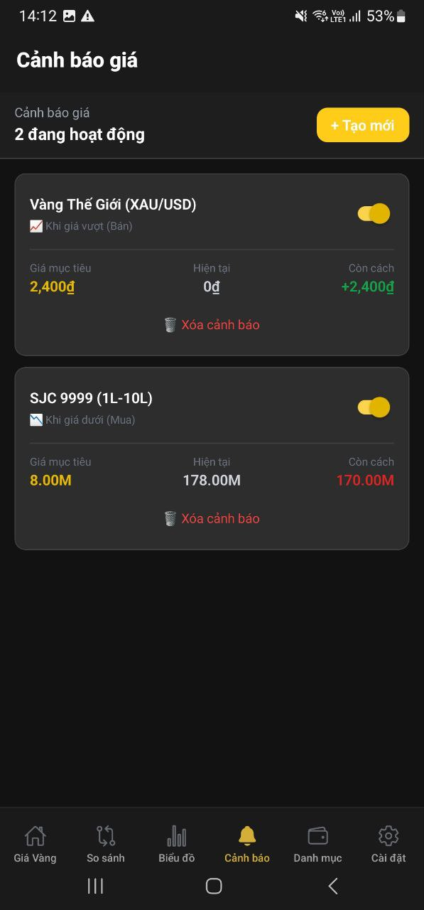

# Gold Price Mobile

<p align="center">
  
</p>

<p align="center">
  <strong>Ứng dụng theo dõi giá vàng real-time cho iOS và Android</strong>
</p>

<p align="center">
  <a href="#features">Features</a> •
  <a href="#installation">Installation</a> •
  <a href="#development">Development</a> •
  <a href="#architecture">Architecture</a> •
  <a href="#contributing">Contributing</a>
</p>

---

## 📱 Screenshots

| Home | So sánh | Biểu đồ | Cảnh báo | Portfolio |
|:---:|:---:|:---:|:---:|:---:|
|  |  |  |  |  |

## ✨ Features

### 🏠 Bảng giá chính
- Giá vàng SJC, DOJI, PNJ, Bảo Tín Minh Châu
- Giá vàng thế giới (XAU/USD)
- Cập nhật real-time qua WebSocket
- Hiển thị % thay đổi so với phiên trước

### 📊 So sánh giá
- So sánh giá mua/bán giữa các tiệm vàng
- Tìm nơi mua rẻ nhất, bán cao nhất
- Filter theo loại vàng (SJC, 999, 24K...)

### 📈 Biểu đồ lịch sử
- Biểu đồ giá theo thời gian (1D, 1W, 1M, 3M, 1Y)
- Interactive charts với zoom/pan
- Candlestick và line chart

### 🔔 Cảnh báo giá
- Đặt cảnh báo khi giá đạt ngưỡng
- Push notifications
- Cảnh báo trên/dưới giá hiện tại

### 💼 Quản lý danh mục
- Theo dõi đầu tư vàng cá nhân
- Tính lãi/lỗ tự động
- Portfolio value real-time

### 📲 Widgets (Coming Soon)
- iOS Widget (WidgetKit)
- Android Widget (Glance)
- Cập nhật giá trên home screen

## 🛠 Tech Stack

| Category | Technology |
|----------|------------|
| Framework | React Native 0.81.5 |
| Platform | Expo SDK 54 |
| Language | TypeScript 5.9 |
| Navigation | Expo Router 6.x |
| Styling | NativeWind + TailwindCSS |
| State | Zustand + React Query |
| Real-time | Socket.IO Client |
| Charts | react-native-gifted-charts |
| Lists | @shopify/flash-list |

## 📦 Installation

### Prerequisites

- Node.js 18+ 
- Yarn (recommended) hoặc npm
- Expo CLI
- iOS Simulator (macOS) hoặc Android Emulator

### Setup

```bash
# Clone repository
git clone https://github.com/your-username/gold-price.git
cd gold-price/gold-price-mobile

# Install dependencies
yarn install

# Start development server
yarn start
```

### Running on devices

```bash
# iOS Simulator (macOS only)
yarn ios

# Android Emulator
yarn android

# Web browser
yarn web
```

### Using Expo Go

1. Install **Expo Go** từ App Store / Play Store
2. Scan QR code từ terminal
3. App sẽ load trên device

## 🔧 Development

### Project Structure

```
gold-price-mobile/
├── app/                  # Expo Router screens
│   ├── (tabs)/           # Tab navigator
│   ├── auth/             # Authentication screens
│   ├── price/            # Price detail screens
│   └── settings/         # Settings screens
├── src/
│   ├── components/       # Reusable UI components
│   ├── hooks/            # Custom React hooks
│   ├── services/         # API & WebSocket services
│   ├── stores/           # Zustand state stores
│   ├── types/            # TypeScript definitions
│   └── utils/            # Utility functions
├── assets/               # Images, fonts, icons
└── ...config files
```

### Environment Variables

Tạo file `.env` trong root:

```env
EXPO_PUBLIC_API_URL=http://localhost:3000/v1
# Socket.IO uses http/https, not ws/wss
EXPO_PUBLIC_WS_URL=http://localhost:3000
```

### Available Scripts

```bash
# Start dev server
yarn start

# Start with cache cleared
yarn start --clear

# Run on iOS
yarn ios

# Run on Android
yarn android

# Run on web
yarn web

# Type check
yarn typecheck

# Lint
yarn lint

# Format code
yarn format
```

### Code Style

Project sử dụng:
- **ESLint** - Linting
- **Prettier** - Code formatting
- **TypeScript** - Type checking

```bash
# Check types
npx tsc --noEmit

# Lint
npx eslint . --ext .ts,.tsx

# Format
npx prettier --write .
```

## 🏗 Architecture

Xem chi tiết tại [ARCHITECTURE.md](./ARCHITECTURE.md)

### Key Patterns

1. **File-based Routing** - Expo Router
2. **Atomic State** - Zustand stores
3. **Server State** - React Query
4. **Real-time** - Socket.IO

### State Management

```typescript
// Zustand store example
const usePriceStore = create<PriceState>((set) => ({
  prices: [],
  setPrices: (prices) => set({ prices }),
}));

// Usage in component
const prices = usePriceStore((state) => state.prices);
```

## 🔌 API Integration

### REST API

```typescript
// src/services/api/priceApi.ts
export const getPrices = async (): Promise<GoldPrice[]> => {
  const response = await apiClient.get('/prices');
  return response.data;
};
```

### WebSocket

```typescript
// src/services/socket/priceSocket.ts
socket.on('price:update', (data) => {
  usePriceStore.getState().updatePrice(data);
});
```

## 📱 Building for Production

### Expo Application Services (EAS)

```bash
# Install EAS CLI
npm install -g eas-cli

# Login
eas login

# Configure
eas build:configure

# Build for iOS
eas build --platform ios

# Build for Android
eas build --platform android
```

### Local Build

```bash
# Create development build
npx expo run:ios
npx expo run:android
```

## 🧪 Testing

```bash
# Run unit tests
yarn test

# Run with coverage
yarn test --coverage

# Run E2E tests (Detox)
yarn test:e2e
```

## 🤝 Contributing

Xem [CONTRIBUTING.md](./CONTRIBUTING.md) để biết cách đóng góp.

### Quick Start

1. Fork repository
2. Create feature branch (`git checkout -b feature/amazing-feature`)
3. Commit changes (`git commit -m 'Add amazing feature'`)
4. Push to branch (`git push origin feature/amazing-feature`)
5. Open Pull Request

## 📄 License

Distributed under the MIT License. See [LICENSE](./LICENSE) for more information.

## 📞 Contact

- **Email**: dev@goldprice.vn
- **Website**: https://goldprice.vn
- **Issues**: [GitHub Issues](https://github.com/your-username/gold-price/issues)

## 🙏 Acknowledgments

- [Expo](https://expo.dev) - Amazing React Native platform
- [NativeWind](https://nativewind.dev) - TailwindCSS for React Native
- [Zustand](https://zustand-demo.pmnd.rs) - Simple state management
- [React Query](https://tanstack.com/query) - Powerful data fetching

---

<p align="center">
  Made with ❤️ in Vietnam 🇻🇳
</p>
